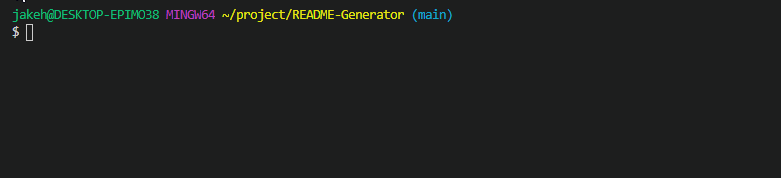
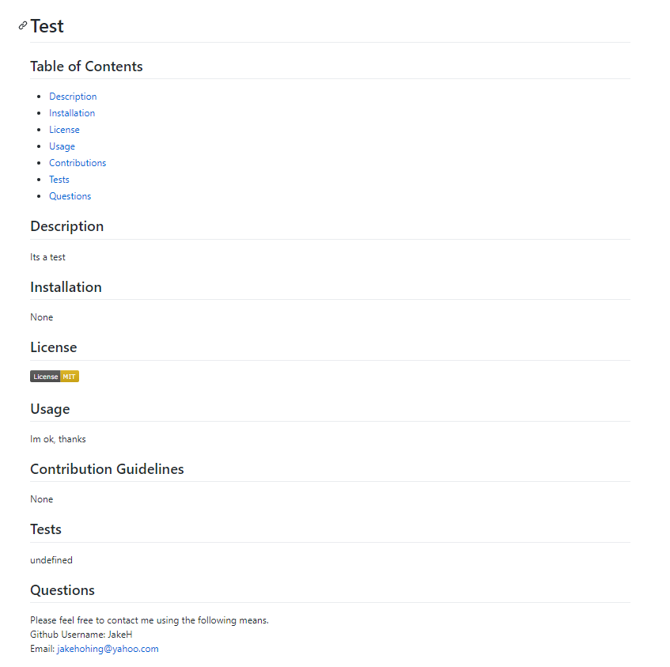

# README-Generator

This Project is designed to provide a descriptive ReadMe for a project, based off of data provided by a user.

- 9 Mandatory prompts will be displayed, one after another. An additonal option prompt will display if there are any contribution guidelines. 
- Once all of the prompts have been answered, a README.md file will be generated in the /Utils sub folder.
- The README will contain all opf the user input, as weel as a License badge and link to said License.

## Video Walkthrough of Prompts and File Generation

## The Generated README

